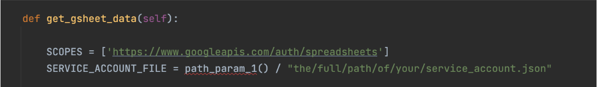
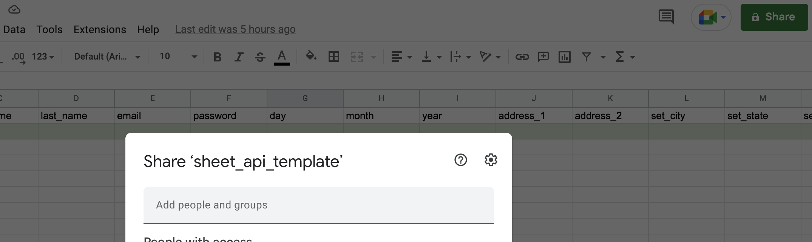
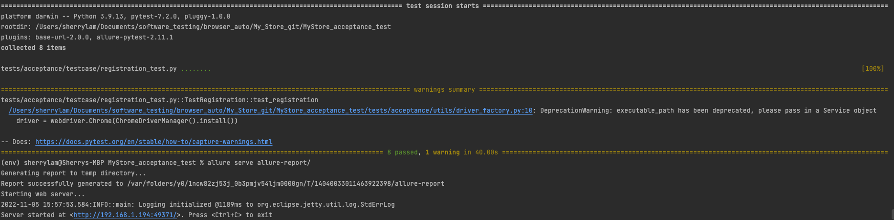

<h1>Acceptance Test for My Store</h1>
http://automationpractice.com/index.php

---
<h2>Introduction</h2>

This acceptance test using Selenium-Webdriver is a project aiming to improve my technical skills. It is written in python, adopts a data-driven approach using data feed via Google Sheet API, and can be displayed on the allure report.This project includes two main tests, a registration test and a login test.
  
<h4>The Registration Test</h4>
The purpose of the registration test is to test if the user can fill the registration form and register successfully, aßnd to test if the personal information the user fills on the registration page is consistent with the information displayed on the personal information page. 
  
<h4>The Login Test</h4>
The purpose of the login test is to test if the user can fill the login form and login successfully using the personal information that is filled on the registration form. 

---
<h2>Setting up the test</h2>

<h3>Download Python</h3>
https://www.python.org/downloads/
  
<h3>Create a virtual environment:</h3>
1. Install pip
2. Install virtual environment
3. create a virtual environment for the test

https://packaging.python.org/en/latest/guides/installing-using-pip-and-virtual-environments/
  

<h3>Install the libraries on requirements.txt into your environment</h3>
Run this command on the terminal of the test folder:

`$ python3 -m pip install -r requirements.txt`
  
<h3>Download Allure</h3>
https://docs.qameta.io/allure-report/#_get_started
  
<h3>Initialize a Google project service account</h3>
Follow the instruction here: 
https://cloud.google.com/apis/docs/getting-started
  
<h3>Enable Google Sheet API</h3>
https://console.cloud.google.com/flows/enableapi?apiid=sheets.googleapis.com&authuser=1
  
<h3>Generate and download a service account key</h3>
1. Click service accounts
2. Select an email
3. Click ‘Key’
4. Click the dropdown ‘Add Key’, and then select ‘Create new key’
5. Add the path of the key next to the slash on gsheet_api.py

  

<h3>Use the Google sheet template provided in the folder</h3>
- You can decide what data you want to send to the form by filling in the data on the green area.
- The test steps files inside the folder called ‘steps’ decide where the data is filled into. 
For example, the data below the cell with acc_email is filled in the email form on the registration page n

<h3>Share the google sheet with the service account email</h3>

  
<h3>Customise your paths</h3>
Add the full local path of this test directory in your computer to the function in the file ./utils/path.py
  
<h3>Generate Allure report using pytest</h3>
To generate a folder to save the allure reports, run:

`$ allure generate`

Run your test with pytest runner in the terminal:

`$ pytest the/full/path/of/the/test.py --alluredir=allure-report/`

Once test execution completes, all the test results would get stored in allure-report directory.
To view the allure-report in the browser, run:

`$ allure serve allure-report/`

Then you can view the test results on the allure report!

<h3>Sources</h3>
This project is inspired by https://github.com/startrug/selenium-python-framework
